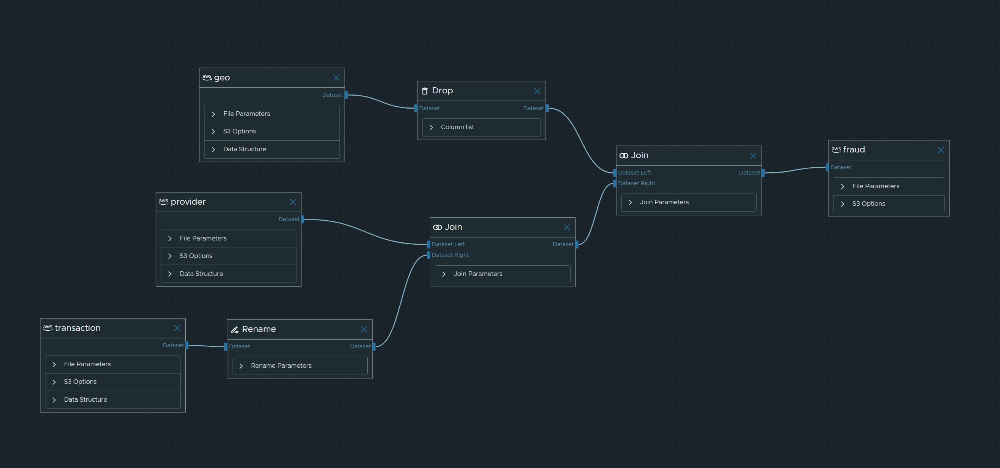

# Credit card fraud detection

## Aim

The primary objective here is to develop a robust use case designed to identify and prevent fraudulent online transactions, a challenge frequently encountered by both retailers and digital-only businesses (pure players). This use case holds significant relevance for the PMU framework, particularly concerning wallet transactions involving reloading of funds.

Our overarching goal is to establish a framework capable of swiftly and accurately detecting fraudulent banking transactions using the available datasets. To achieve this, we will construct a model that assesses each transaction by assigning it a fraud indicator. The implementation of this model will be facilitated through the use of Graal's comprehensive suite of services, encompassing its workspaces and low-code engine.

To outline our approach for this use case, we will begin by initiating a low-code data integration job, allowing us to seamlessly amalgamate the available data sources. Following this, we will delve into an exploration of the data, meticulously examining its attributes and characteristics to uncover potential insights and opportunities. Subsequently, we will embark on the creation of a low-code job aimed at modelling fraudulent activities. This model will then undergo refinement and optimization, ultimately culminating in its deployment and exposure for efficient fraud detection and prevention.

## Data integration

The fraud data is composed of 3 datasets : `transaction.csv` (description of the transactions), `geo.csv` (information of IP per country) and `provider.csv` (name of the provider for each IP range). The dataset columns are described below.

### Transaction dataset :credit_card:

|  Column name 	  |    Description        	     |  Type  	  |   Example     	    |
|:---------------:|:---------------------------:|:---------:|:------------------:|
| `CN`          	 | Card number               	 | Integer 	 | 6011636165535360 	 |
| `date`        	 | Date of the transaction   	 |  Date  	  | 2022-02-01       	 |
| `montant`     	 | Transaction amount        	 | Integer 	 | 13595            	 |
| `ip`          	 | IP address                	 | String  	 | 6.200.204.63     	 |
| `ip_range`   	  | Range of the IP address   	 | String  	 | 6.0.0.0/8        	 |
| `is_valid`    	 | Is the transaction valid? 	 | Boolean 	 | True             	 |

### Geographic dataset :world_map:

|  Column name          	  | Description           	 | Type             	 | Example       	 |
|:------------------------:|:-----------------------:|:------------------:|:---------------:|
| `ip_range`             	 | Range of IP addresses 	 | String           	 | 163.10.0.0/16 	 |
| `country_name`         	 | Country name          	 | String           	 | Argentina     	 |
| `continent_name`       	 | Continent name        	 | String           	 | South America 	 |
| `continent_code`       	 | Continent code        	 | String           	 | SA            	 |
| `is_in_european_union` 	 | Is the country in EU? 	 | Integer (0 or 1) 	 | 0             	 |

### Provider dataset :globe_with_meridians:

|  Column name 	  |   Description      	    | Type  	  |   Example    	   |
|:---------------:|:-----------------------:|:--------:|:----------------:|
| `ip_range`    	 | Range of IP addresses 	 | String 	 | 101.144.0.0/12 	 |
| `provider`    	 | IP provider           	 | String 	 | CyberGhost     	 |

## Data exploration

### Integrating the datasets

First we create a job to integrate the datasets from S3 (3 csv files) to S3 (1 parquet file).



### Exploring the data

Then, once the datasets are merged, we can explore the datasets using a notebook in a workspace. In the notebook we can have more information about the data types, and some statistics for the different columns.

We also did some data visualization to analyse the data distribution, and the correlation between different variables. This will help us understanding the data in order to choose the right model for the training.


### Creating a low-code model for fraud detection

We can create a simple model (Random Forest) by importing the dataset we previously created. Then it model can be exported in a pickle or joblib format on a S3-like bucket.


Then, the code can be exported in different languages (pandas, PySpark, Java Spark, Apache Beam, Dask, Flink). Here we have exported the code in pandas so we can enhance it.


### Expanding the low-code model

The low-code job generate some code that can be enhanced on a workspace.

```python
import pandas as pd
from sklearn.ensemble import RandomForestClassifier
from sklearn.model_selection import train_test_split
from sklearn import model_selection
from sklearn.metrics import accuracy_score
import s3fs
import joblib

df_e8c0e4da = pd.read_parquet(
    "path/to/data/fraud.parquet",
    storage_options={
        "key": "key",
        "secret": "secret-key",
        "client_kwargs": {
            "endpoint_url": "endpoint-url",
            "region_name": "region-name",
        },
    },
)

# Implementing a RandomForestClassifier model
x_columns = df_e8c0e4da[["ip_range", "provider", "country_name", "continent_name", "is_in_european_union"]]
y_column = df_e8c0e4da["is_valid"]
X_train, X_test, y_train, y_test = train_test_split(
    x_columns, y_column, test_size=0.2, random_state=42
)

# Random forest regressor
model_83ea8978 = RandomForestClassifier(n_estimators=1000, max_depth=3, random_state=42)
model_83ea8978.fit(X_train, y_train)

# Model prediction
y_pred_test = model_83ea8978.predict(X_test)

# Metrics
print(f"accuracy_score: {accuracy_score(y_test, y_pred_test)}")  # accurracy is automatically printed

# Exporting the model
s3 = s3fs.S3FileSystem(
    key="key",
    secret="secret-key",
    client_kwargs={
        "endpoint_url": "endpoint-url",
        "region_name": "region-name",
    },
)
joblib.dump(
    model_83ea8978,
    s3.open("path/to/fraud/model.joblib", "wb"),
)
```